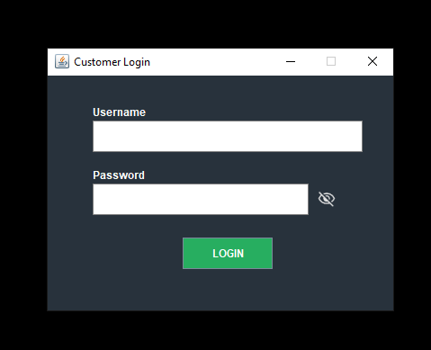
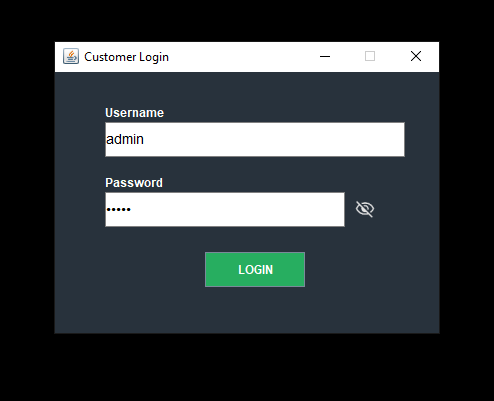
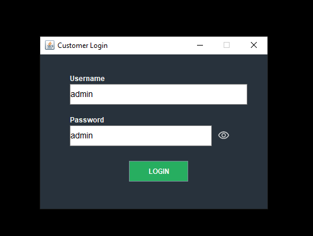
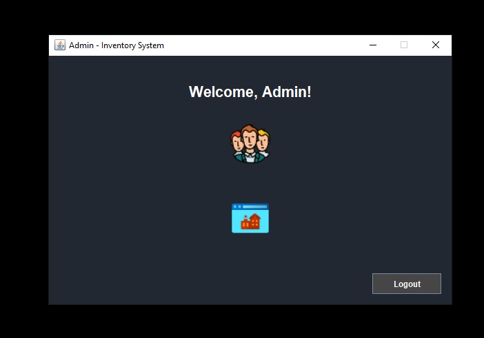

# Local Vendor Inventory Tracker - POS Edition

A fully-featured Java-based desktop Point-of-Sale and Inventory Management System, developed as part of the **CodeShapeIT Internship**.

----
# Note
## Use these for sample login
- **Username = admin**
- **Password = admin123**

------

## ✅ Features

- **Product Management**  
  Add, update, delete, view, and search products with category support.

- **Inventory Dashboard**  
  Visual summary with total products, stock, and low stock alerts.

- **Sales Management**  
  Record POS-style product sales, auto-update stock, and generate bills.

- **CSV Support**  
  Import and export inventory data to and from CSV files.

- **Sales Analytics Dashboard**  
  View top-selling products, total revenue, category-wise and time-based sales with charts.

- **PDF & Print Support**  
  Generate printable bills and export them as PDFs.

- **User Authentication & Management**  
  Login system with roles and full user CRUD (admin only).

- **Clean Modular Architecture**  
  Well-structured Model-DAO-Service-View pattern for maintainability.

---

## 🧪 Testing Coverage

- All major features tested with edge cases (stock limits, invalid inputs)
- Sales tested with dynamic products and real-time stock deduction
- CSV Import tested with 500+ products, including edge cases and validation
- Analytics tested for accuracy using test sales data
- Billing PDF and print preview successfully generated and reviewed
- Login and user management verified with multiple accounts

---

## 🧱 Technologies Used

- Java 17+
- Swing (GUI)
- SQLite
- JDBC
- iText (PDF)
- JFreeChart (Charts)
- IntelliJ IDEA

---

## 📂 Project Structure

src/
└── app/
├── model/ # Product.java, Sale.java, User.java, BillItem.java
├── dao/ # ProductDAO.java, SalesDAO.java, UserDAO.java
├── service/ # ProductService.java, SalesAnalyticsService.java
├── view/ # All Swing UI classes (MainWindow, BillingWindow, Dashboard, etc.)
├── util/ # DBUtil.java, CSVUtil.java, ChartUtil.java
└── MainApp.java # Entry point

---

## 🚀 How to Run

1. **Clone this repository**
2. **Open in IntelliJ IDEA**
3. **Ensure these `.jar` files are added to your `lib/` folder and linked in classpath:**
    - `sqlite-jdbc-<version>.jar`
    - `itextpdf-<version>.jar`
    - `jfreechart-<version>.jar`
4. **Run `MainApp.java`**  
   This will launch the login screen, leading to the main system.

---

## 📸 Sample Screenshots of different windows

---

## 👨‍💻 Author

**Saurabh Pandey**  
*CodeShapeIT Solutions Internship Project (2025)*
